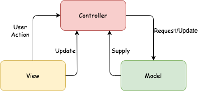

# Latex-Editor

A LaTeX Editor in Java 8.

## User Stories

* [US-1] As a user, I want to create a new Latex document, based on a particular Latex document template. If I don't specify a template, the application should create an empty Latex document.

* [US-2] As a user, I want to edit the contents of the Latex document, via the application's user interface.

* [US-3] As a user, I want to add Latex commands in the Latex document automatically using the application user interface. A minimal set of Latex commands that I want to use is given in Table 1. Some of the commands are allowed only for specific types of Latex documents. The application should notify me if I try to add Latex commands that are not allowed in the Latex document.

* [US-4] As a user, I should be able to activate an automatic version tracking mechanism that keeps track of the document evolution history, at any time. The history consists of a sequence of subsequent versions of the Latex document. The mechanism should provide at least two alternative storage strategies for the document evolution history:

    * Volatile (default strategy): for each document change the mechanism keeps the previous version of the document in a main memory list of subsequent document versions.

    * Stable: for each document change the mechanism keeps the previous version of the document on disk storage.

* [US-5] As a user, I should be able to change the storage strategy of the version tracking mechanism at any time.

    * If I change from Volatile to Stable the application should store the document evolution history on disk storage.

    * If I change from Stable to Volatile the application should load the document evolution history from disk storage to main memory.

* [US-6] As a user, I should be able to disable the version tracking mechanism at any time.

* [US-7] As a user, I should be able to rollback to a previous version of the Latex document based on the document evolution history. The application should notify me if I try to use the rollback action and the version tracking mechanism has not been enabled before.

* [US-8] As a user, I should be able to save the Latex document on disk storage.

* [US-9] As a user, I should be able to load the Latex document from disk storage.
 
 

## Design
* We used the MVC (Model View Controller) package design.
 
 

* Design Patterns used:
    * Command Pattern.
    * Prototype Pattern.
    * Parameterized Factory Pattern.
    * Strategy Pattern.
 
 

## Acceptance Testing

* We used the [Junit](https://github.com/junit-team/junit4) Framework to test the application. 
* Run AllTests to execute the unit tests via Junit.
 
 

## Class Diagram
